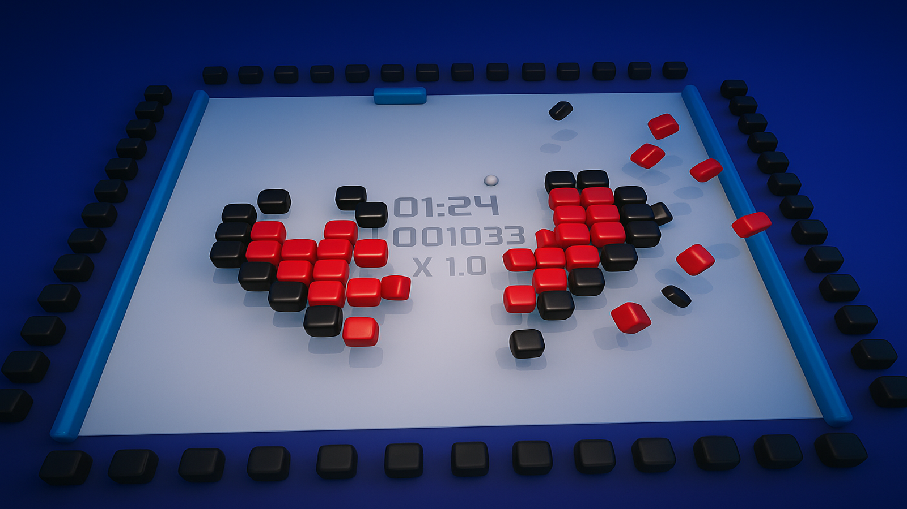
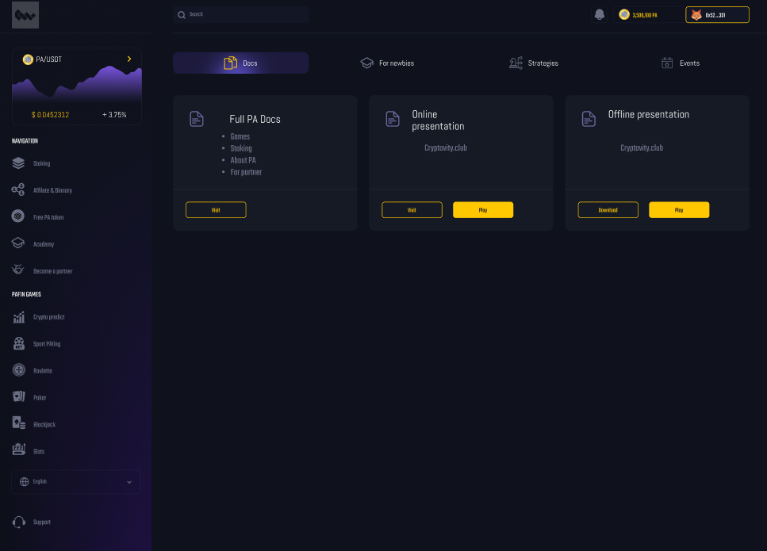
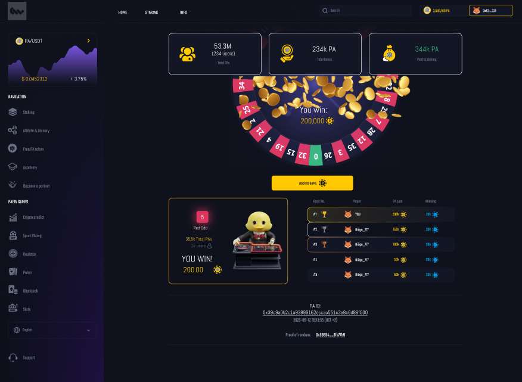

# 🃏 SettleMint - Web3 Poker Gaming Platform



[](LICENSE)
[](https://reactjs.org/)
[](https://nodejs.org/)
[](https://mongodb.com/)
[](https://socket.io/)

## 📖 Table of Contents

- [Overview](#overview)
- [Features](#features)
- [Tech Stack](#tech-stack)
- [Project Architecture](#project-architecture)
- [Getting Started](#getting-started)
- [Environment Variables](#environment-variables)
- [API Endpoints](#api-endpoints)
- [Game Mechanics](#game-mechanics)
- [WebSocket Events](#websocket-events)
- [Project Structure](#project-structure)
- [Screenshots](#screenshots)
- [Contributing](#contributing)
- [Roadmap](#roadmap)

---

## 🎯 Overview

**SettleMint** is a cutting-edge Web3 gaming platform that combines the excitement of Texas Hold'em Poker with blockchain technology. The platform offers a secure, provably fair gaming environment where players can connect their wallets, join poker tables, and compete in real-time multiplayer games.

This full-stack application features a React frontend with real-time WebSocket communication, a Node.js/Express backend, MongoDB for data persistence, and comprehensive poker game logic with hand evaluation, side pots, and dealer button rotation.

---

## ✨ Features

### 🎮 Core Gaming Features

- **Texas Hold'em Poker** - Full implementation with proper betting rounds (pre-flop, flop, turn, river)
- **Real-time Multiplayer** - Up to 5 players per table with live updates via Socket.io
- **Hand Evaluation** - Powered by pokersolver for accurate hand ranking
- **Side Pots** - Automatic calculation and distribution of side pots for all-in scenarios
- **Dealer Button Rotation** - Proper dealer button movement between hands
- **Blind System** - Small blind and big blind implementation

### 💼 User Features

- **Wallet Connection** - Web3 wallet integration for authentication
- **Player Chips** - New players start with 100,000 free chips
- **User Profiles** - Nickname, email, and account management
- **Dashboard** - Manage profile settings and view statistics

### 🎨 UI/UX Features

- **Dark/Light Theme** - Toggle between themes with persistent preference
- **Sound Effects** - Audio feedback for game actions
- **Responsive Design** - Optimized for desktop and mobile devices
- **Card Animations** - Smooth dealing and reveal animations
- **Welcome Screen** - Onboarding for first-time users
- **Loading States** - Elegant loading screens and transitions

### 🔒 Security Features

- **JWT Authentication** - Secure token-based authentication
- **Password Hashing** - bcryptjs for secure password storage
- **Input Sanitization** - XSS protection and MongoDB injection prevention
- **Rate Limiting** - Protection against brute force attacks
- **Helmet Security** - HTTP headers for enhanced security

---

## 🛠 Tech Stack

### Frontend

| Technology        | Purpose                 |
| ----------------- | ----------------------- |
| React 16.13       | UI Framework            |
| React Router v6   | Client-side routing     |
| Styled Components | CSS-in-JS styling       |
| SCSS/Sass         | Advanced styling        |
| Bootstrap 5       | UI Components           |
| Zustand           | State management        |
| Socket.io Client  | Real-time communication |
| Ethers.js         | Web3 integration        |
| SweetAlert2       | Beautiful alerts        |

### Backend

| Technology  | Purpose             |
| ----------- | ------------------- |
| Node.js     | Runtime environment |
| Express.js  | Web framework       |
| MongoDB     | Database            |
| Mongoose    | ODM                 |
| Socket.io   | WebSocket server    |
| JWT         | Authentication      |
| bcryptjs    | Password hashing    |
| pokersolver | Hand evaluation     |

### Development Tools

| Tool         | Purpose               |
| ------------ | --------------------- |
| Concurrently | Run multiple scripts  |
| Nodemon      | Development server    |
| dotenv       | Environment variables |

---

## 🏗 Project Architecture

```
┌─────────────────────────────────────────────────────────────────┐
│                        CLIENT (React)                            │
├─────────────────────────────────────────────────────────────────┤
│  ┌──────────┐  ┌──────────┐  ┌──────────┐  ┌──────────┐        │
│  │  Pages   │  │Components│  │ Context  │  │  Hooks   │        │
│  └────┬─────┘  └────┬─────┘  └────┬─────┘  └────┬─────┘        │
│       │             │             │             │               │
│       └─────────────┴─────────────┴─────────────┘               │
│                          │                                      │
│                   ┌──────┴──────┐                               │
│                   │ Socket.io   │                               │
│                   │   Client    │                               │
│                   └──────┬──────┘                               │
└──────────────────────────┼──────────────────────────────────────┘
                           │ WebSocket
┌──────────────────────────┼──────────────────────────────────────┐
│                   ┌──────┴──────┐                               │
│                   │ Socket.io   │                               │
│                   │   Server    │                               │
│                   └──────┬──────┘                               │
│                          │                                      │
│        SERVER (Node.js/Express)                                 │
│  ┌──────────┐  ┌──────────┐  ┌──────────┐  ┌──────────┐        │
│  │  Routes  │  │Controllers│  │Middleware│  │  Models  │        │
│  └────┬─────┘  └────┬─────┘  └────┬─────┘  └────┬─────┘        │
│       │             │             │             │               │
│       └─────────────┴─────────────┴─────────────┘               │
│                          │                                      │
│                   ┌──────┴──────┐                               │
│                   │   MongoDB   │                               │
│                   │  Database   │                               │
│                   └─────────────┘                               │
└─────────────────────────────────────────────────────────────────┘
```

---

## 🚀 Getting Started

### Prerequisites

- Node.js (v14 or higher)
- MongoDB (local or Atlas)
- npm or yarn

### Installation

1. **Clone the repository**

   ```bash
   git clone <repository-url>
   cd redstoneproject-testproject-ca6d1be239a3
   ```

2. **Install dependencies**

   ```bash
   npm install
   ```

3. **Configure environment variables**

   Create a `local.env` file in the `server/config/` directory:

   ```env
   PORT=3030
   NODE_ENV=development
   JWT_SECRET=your_jwt_secret_key
   MONGO_URI=mongodb://localhost:27017/poker-game
   ```

4. **Start MongoDB**

   ```bash
   # Using MongoDB locally
   mongod
   ```

5. **Run the application**

   ```bash
   # Development mode (with hot reload)
   npm start

   # Or run server and client separately
   npm run server  # Backend on port 3030
   npm run client  # Frontend on port 3000
   ```

6. **Access the application**

   Open your browser and navigate to `http://localhost:3000`

---

## ⚙️ Environment Variables

| Variable               | Description                    | Default       |
| ---------------------- | ------------------------------ | ------------- |
| `PORT`                 | Server port                    | `3030`        |
| `NODE_ENV`             | Environment mode               | `development` |
| `JWT_SECRET`           | JWT signing secret             | Required      |
| `MONGO_URI`            | MongoDB connection string      | Required      |
| `INITIAL_CHIPS_AMOUNT` | Starting chips for new players | `100000`      |

---

## 🔌 API Endpoints

### Authentication Routes (`/api/auth`)

| Method | Endpoint    | Description           |
| ------ | ----------- | --------------------- |
| POST   | `/register` | Register a new user   |
| POST   | `/login`    | Authenticate user     |
| GET    | `/user`     | Get current user info |
| GET    | `/logout`   | Logout user           |

### User Routes (`/api/users`)

| Method | Endpoint | Description    |
| ------ | -------- | -------------- |
| GET    | `/`      | Get all users  |
| GET    | `/:id`   | Get user by ID |
| PUT    | `/:id`   | Update user    |
| DELETE | `/:id`   | Delete user    |

### Chips Routes (`/api/chips`)

| Method | Endpoint  | Description            |
| ------ | --------- | ---------------------- |
| GET    | `/`       | Get user's chips       |
| POST   | `/add`    | Add chips to user      |
| POST   | `/deduct` | Deduct chips from user |

---

## 🎲 Game Mechanics

### Poker Table Configuration

```javascript
{
  maxPlayers: 5,
  minBet: limit / 40,      // Small blind
  minRaise: limit / 20,    // Minimum raise amount
  initialChips: 100000
}
```

### Player Actions

| Action    | Description                        |
| --------- | ---------------------------------- |
| **Fold**  | Discard hand and forfeit the round |
| **Check** | Pass when no bet is required       |
| **Call**  | Match the current bet              |
| **Raise** | Increase the current bet           |

### Hand Rankings (Highest to Lowest)

1. Royal Flush
2. Straight Flush
3. Four of a Kind
4. Full House
5. Flush
6. Straight
7. Three of a Kind
8. Two Pair
9. One Pair
10. High Card

### Game Flow

```
1. Players join table and sit at available seats
2. Dealer button is assigned
3. Blinds are posted (Small Blind & Big Blind)
4. Cards are dealt (2 hole cards per player)
5. Pre-flop betting round
6. Flop (3 community cards) + betting round
7. Turn (1 community card) + betting round
8. River (1 community card) + betting round
9. Showdown - Best hand wins the pot
10. Dealer button moves to next player
```

---

## 📡 WebSocket Events

### Client → Server Events

| Event                 | Payload                                         | Description           |
| --------------------- | ----------------------------------------------- | --------------------- |
| `CS_LOBBY_CONNECT`    | `{ gameId, address, userInfo }`                 | Connect to game lobby |
| `CS_FETCH_LOBBY_INFO` | `{ walletAddress, socketId, gameId, username }` | Fetch lobby data      |
| `CS_JOIN_TABLE`       | `{ tableId }`                                   | Join a poker table    |
| `CS_LEAVE_TABLE`      | `{ tableId }`                                   | Leave a poker table   |
| `CS_SIT_DOWN`         | `{ tableId, seatId, amount }`                   | Sit at a seat         |
| `CS_STAND_UP`         | `{ tableId }`                                   | Stand up from seat    |
| `CS_FOLD`             | `{ tableId }`                                   | Fold hand             |
| `CS_CHECK`            | `{ tableId }`                                   | Check                 |
| `CS_CALL`             | `{ tableId }`                                   | Call bet              |
| `CS_RAISE`            | `{ tableId, amount }`                           | Raise bet             |
| `CS_REBUY`            | `{ tableId, seatId, amount }`                   | Rebuy chips           |
| `CS_LOBBY_CHAT`       | `{ gameId, text, userInfo }`                    | Send chat message     |

### Server → Client Events

| Event                   | Payload                                 | Description                |
| ----------------------- | --------------------------------------- | -------------------------- |
| `SC_LOBBY_CONNECTED`    | `{ address, userInfo }`                 | Lobby connection confirmed |
| `SC_RECEIVE_LOBBY_INFO` | `{ tables, players, socketId, amount }` | Initial lobby data         |
| `SC_TABLE_JOINED`       | `{ table }`                             | Table join confirmation    |
| `SC_TABLE_LEFT`         | `{ tableId }`                           | Table left confirmation    |
| `SC_TABLE_UPDATED`      | `{ table }`                             | Table state update         |
| `SC_TABLES_UPDATED`     | `{ tables }`                            | All tables update          |
| `SC_PLAYERS_UPDATED`    | `{ players }`                           | Players list update        |
| `SC_LOBBY_CHAT`         | `{ text, userInfo }`                    | Chat message received      |
| `WINNER`                | `{ winner, amount }`                    | Winner announcement        |

---

## 📁 Project Structure

```
redstoneproject-testproject-ca6d1be239a3/
├── public/                     # Static assets
│   ├── sounds/                 # Audio files
│   ├── index.html              # HTML template
│   ├── manifest.json           # PWA manifest
│   └── robots.txt              # SEO robots file
│
├── server/                     # Backend source
│   ├── config/                 # Configuration files
│   │   ├── db.js               # MongoDB connection
│   │   ├── loadEnv.js          # Environment loader
│   │   └── local.env           # Local environment vars
│   ├── controllers/            # Request handlers
│   │   ├── auth.js             # Authentication logic
│   │   ├── chips.js            # Chips management
│   │   └── users.js            # User management
│   ├── middleware/             # Express middleware
│   │   ├── auth.js             # JWT verification
│   │   ├── index.js            # Middleware setup
│   │   └── logger.js           # Request logging
│   ├── models/                 # Mongoose models
│   │   └── User.js             # User schema
│   ├── pokergame/              # Game logic
│   │   ├── actions.js          # Socket action constants
│   │   ├── Deck.js             # Card deck logic
│   │   ├── Player.js           # Player class
│   │   ├── Seat.js             # Seat management
│   │   ├── SidePot.js          # Side pot calculation
│   │   └── Table.js            # Table & game logic
│   ├── routes/                 # API routes
│   │   ├── index.js            # Route aggregator
│   │   └── api/                # API endpoints
│   ├── socket/                 # WebSocket handlers
│   │   ├── index.js            # Socket.io setup
│   │   └── packet.js           # Packet utilities
│   ├── utils/                  # Utility functions
│   ├── config.js               # Server config
│   └── server.js               # Entry point
│
├── src/                        # Frontend source
│   ├── apis/                   # API client
│   ├── assets/                 # Static assets
│   │   ├── fonts/              # Custom fonts
│   │   └── game/               # Game images
│   │       └── cards/          # Card images
│   ├── components/             # React components
│   │   ├── buttons/            # Button components
│   │   ├── connection/         # Connection status
│   │   ├── cookies/            # Cookie banner
│   │   ├── decoration/         # Decorative elements
│   │   ├── forms/              # Form components
│   │   ├── game/               # Game components
│   │   │   ├── Betslider/      # Betting slider
│   │   │   ├── BrandingImage/  # Branding
│   │   │   └── Seat/           # Player seats
│   │   ├── icons/              # Icon components
│   │   ├── layout/             # Layout components
│   │   ├── loading/            # Loading states
│   │   ├── logo/               # Logo components
│   │   ├── modals/             # Modal components
│   │   ├── navigation/         # Nav components
│   │   ├── onboarding/         # Welcome screens
│   │   ├── routing/            # Route definitions
│   │   ├── sound/              # Sound controls
│   │   ├── theme/              # Theme toggle
│   │   ├── typography/         # Text components
│   │   └── user/               # User components
│   ├── context/                # React context
│   │   ├── game/               # Game state
│   │   ├── global/             # Global state
│   │   ├── modal/              # Modal state
│   │   ├── sound/              # Sound state
│   │   ├── theme/              # Theme state
│   │   └── websocket/          # Socket state
│   ├── pages/                  # Page components
│   │   ├── ConnectWallet/      # Wallet connection
│   │   ├── Play/               # Game page
│   │   └── NotFoundPage/       # 404 page
│   ├── pokergame/              # Client game logic
│   ├── styles/                 # Global styles
│   ├── App.js                  # App component
│   ├── App.scss                # App styles
│   ├── clientConfig.js         # Client config
│   ├── index.js                # Entry point
│   └── serviceWorker.js        # PWA service worker
│
├── .env                        # Environment variables
├── .gitignore                  # Git ignore rules
├── jsconfig.json               # JS configuration
├── package.json                # Dependencies
└── README.md                   # This file
```

---

## 📸 Screenshots

### Welcome Screen



### Game Table



---

## 🤝 Contributing

We welcome contributions! Please follow these steps:

1. Fork the repository
2. Create a feature branch (`git checkout -b feature/amazing-feature`)
3. Commit your changes (`git commit -m 'Add amazing feature'`)
4. Push to the branch (`git push origin feature/amazing-feature`)
5. Open a Pull Request

### Code Style Guidelines

- Use meaningful variable and function names
- Add comments for complex logic
- Follow existing code structure
- Write unit tests for new features

---

## 🗺 Roadmap

### Phase 1 - Core Features ✅

- [x] Texas Hold'em poker logic
- [x] Real-time multiplayer
- [x] User authentication
- [x] Wallet connection

### Phase 2 - Enhanced Gaming 🚧

- [ ] Tournament mode
- [ ] Multiple table support
- [ ] Spectator mode
- [ ] Game history

### Phase 3 - Web3 Integration 📋

- [ ] NFT card backs
- [ ] Token staking
- [ ] Crypto betting
- [ ] Leaderboard with rewards

### Phase 4 - Social Features 📋

- [ ] Friends system
- [ ] Private tables
- [ ] In-game chat
- [ ] Player statistics

---

## 📄 License

This project is currently unlicensed. All rights reserved.

---

## 📞 Support

For support, please open an issue in the repository or contact the development team.

---

<div align="center">

**Built with ❤️ by the SettleMint Team**

[Play Now](#getting-started) · [Report Bug](https://github.com/issues) · [Request Feature](https://github.com/issues)

</div>
